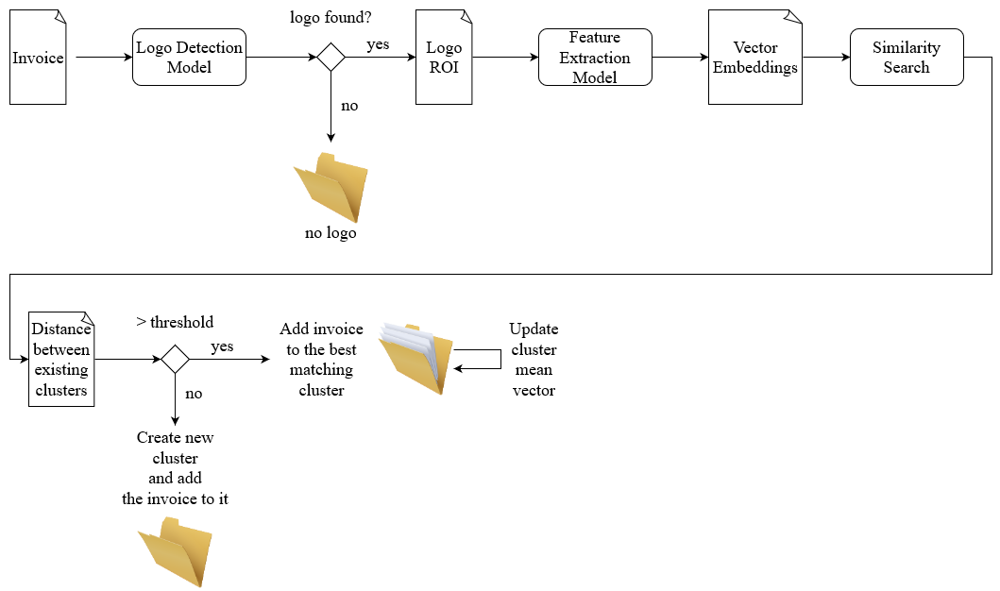
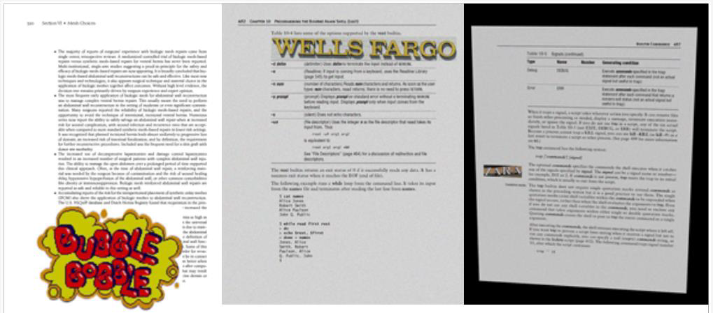
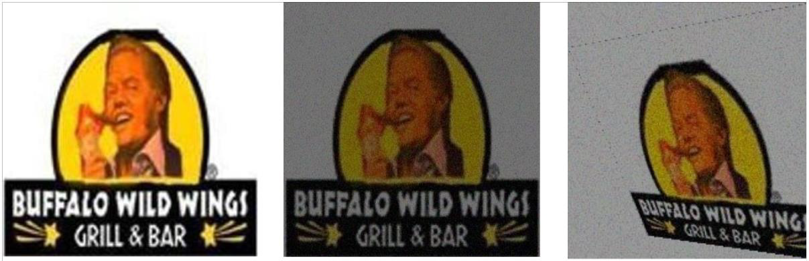

# InvoiceCluster - Invoice unsupervised classification based on brand logos
## Description
Due to the fact that ~70% of invoice processing occurs manually, grouping same-company invoices could
speed up the manual financial processing, because same-company invoices share a similar structure and contain mostly the
same fields.
## Motivation
Supervised classification requires exact knowledge about the number of classes, and because a company changes
collaborators over time, it would be infeasible to retrain a classification model on future and past collaborators.
I chose to detect logos as a singular class in invoices and classify the invoices based on the logos in an unsupervised 
manner.
## Architecture

## Methodology
### Logo Detection
Because invoices are not available for download due to GDPR, I created my own dataset using written materials as 
background and added a logo at a random position on top of it. I further augmented the images with gaussian blur and 
perspective transformations to imitate a photo taken of an invoice, in the case where a digital version in unavailable.

I created 1000 invoice alike images with 1000 different logos and split them into 50-40-10 for train-val-test. I 
performed a grid-search on the newer small YOLO models, ranging from YOLOv5 to YOLOv8 and trained them for 150 epochs 
with their default configurations. The results listed below are the evaluation on the test set.

| Model   | Precision | Recall | mAP 0.5 | mAP 0.5:0.95 |
|---------|-----------|--------|---------|--------------|
| YOLOv5s | 0.943     | 0.96   | 0.966   | 0.903        |
| YOLOv6s | 0.948     | 0.94   | 0.955   | 0.902        |
| YOLOv7s | 0.928     | 0.966  | 0.943   | 0.873        |
| YOLOv8s | 0.937     | 0.97   | 0.975   | 0.928        |

After hyperparameter tuning I obtained

| Model         | Precision | Recall | mAP 0.5 | mAP 0.5:0.95 |
|---------------|-----------|--------|---------|--------------|
| YOLOv8s tuned | 0.97      | 0.972  | 0.978   | 0.938        |

with the following configuration

| Epochs | Warmup-epochs | Optimizer | Momentum | lr   | lr-schedule |
|--------|---------------|-----------|----------|------|-------------|
| 40     | 3             | Adam      | 0.9      | 1e-3 | 0.0015      |

### Unsupervised Classification
I selected 350 different brand logos and I augmented them analogous to the invoice augmentations with 10 samples per 
logo.

In order to compare the similarity between images, I extracted the vector embedding from the last layer before the
classification layer of a couple similar architectures and used the cosine similarity metric. The average same-class 
similarity is computed between all samples that share the same class. The minimum average same-class similarity is 
computed between all lowest scoring embedding from each class. The top k metrics are the average of the top k similar 
embeddings, if we remove the identity class from the computation. This metric is especially important, if we want to 
classify new logo classes. The purity is the rate of all the same class embeddings being closer to the actual embedding,
opposed to different classes.

| Architecture   | Embedding size | Average  same-class similarity | Minimum average  same-class similarity | top 1      | top3       | top5       | purity    |
|----------------|----------------|------------------------------------|--------------------------------------------|------------|------------|------------|-----------|
| DenseNet161    | 2208           | 0.918847                           | 0.838223                                   | 0.793361   | 0.788505   | 0.784919   | 0.609467  |
| InceptionV3    | 2048           | 0.884202                           | 0.775867                                   | 0.788867   | 0.782704   | 0.778200   | 0.260355  |
| ResNet50       | 2048           | 0.876431                           | 0.748806                                   | 0.742633   | 0.734529   | 0.728807   | 0.352071  |
| EfficientNetV2 | 1280           | 0.843669                           | 0.671699                                   | 0.663700   | 0.652170   | 0.644273   | 0.337278  |

After choosing DenseNet161 as the best feature extractor, I conducted multiple experiment with different cosine 
similarity thresholds and a threshold of 0.83 yielded the best results after 10 iterations.
 
| Metric / No.classes | 10            | 50            | 100           | 350           | 
|---------------------|---------------|---------------|---------------|---------------|
| NMI                 | 0.988 ± 0.009 | 0.976 ± 0.006 | 0.965 ± 0.011 | 0.933 ± 0.003 |
| ARI                 | 0.978 ± 0.018 | 0.886 ± 0.045 | 0.760 ± 0.103 | 0.383 ± 0.034 |

When using a small threshold, different class samples will be clustered together. In opposition, when using a big 
threshold, same class samples will be clustered in different clusters, resulting in more clusters, than the initial 
number of classes. ARI and NMI metrics favourize big thresholds, but in reality we do not want multiple clusters per 
class.
## Technologies Used
PyTorch - model zoo, model manipulation and model training 
Numpy - embedding storing and manipulation 
Pandas - metric storing during training 
Flask - lightweight web app 